# Get Insights from OrientDB database using PyOrient through IBM Watson Studio

> Data Science Experience is now Watson Studio. Although some images in this code pattern may show the service as Data Science Experience, the steps and processes will still work.

This journey gives you a head start on how to work with graphs in OrientDB through IBM Watson Studio using PyOrient module - a python driver for OrientDB to operate on data and to get insights from OrientDB. IBM Watson Studio can be used to analyze data using Jupyter notebooks.

OrientDB is a multi-model database, supporting graph, document, key/value, and object models, but the relationships are managed as in graph databases with direct connections between records. Graph databases are well-suited for analysing interconnections like to mine data from social media. It is also useful for working with data in business disciplines that involve complex relationships and dynamic schema and creating recommendations like "customers who bought this also looked at...". This journey will help you to understand end-to-end flow starting from downloading the data-set, cleansing of data, extract entities and relations from the data-set, connect with OrientDB, create a new OrientDB database, populate database with node classes, edge classes, vertices, relations and then execute queries to get insights from the data in OrientDB database. OrientDB have extended SQL to provide support for graph traversal in graph database making it easy for developers familiar with SQL to start exploring graph database for their business needs.

In this journey we will demonstrate:
* Setting up ipython notebook on Watson Studio connecting to OrientDB using PyOrient.
* To perform the CRUD operations and extracting insights from OrientDB database.

To achieve this, OrientDB instance is created on the Kubernetes Cluster and then it is accessed through IBM Watson Studio. This journey will help developers to get started with various OrientDB operations like CRUD, basic traversal and extracting insights using PyOrient on IBM Watson Studio.

When the reader has completed this journey, they will understand how to:
- Create Kubernetes Cluster and deploy OrientDB on it.
- Create and Run a Jupyter Notebook in IBM Watson Studio.
- Run OrientDB queries using PyOrient module in IBM Watson Studio.
- Visualise the OrientDB result in OrientDB Studio.

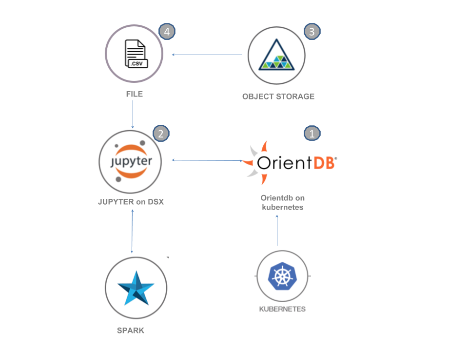

1. The developer sets up the Kubernetes cluster using Kubernetes service on IBM Cloud.
2. The OrientDB instance is deployed on the Kubernetes cluster created by the developer in the first step with persistent volume, exposing the ports(2424, 2480) used by OrientDB on bluemix.
3. The developer creates a Jupyter notebook on the IBM Watson Studio powered by spark. While creation of notebook, an instance of Object Storage is attached to the notebook for storing the data used by the notebook.
4. The developer uploads the configuration file (config.json) and the dataset (graph-insights.csv) in the object storage.
5. The credentials of Object Storage are updated in the notebook and the files from Object Storage are loaded to create graph  from them in OrientDB.
6. The notebook communicates with the OrientDB through PyOrient driver. And various operations are performed on the OrientDB  using functions written in the Jupyter notebook.

## Included components

* [OrientDB](http://orientdb.com/orientdb/): A Multi-Model Open Source NoSQL DBMS.

* [IBM Watson Studio](https://dataplatform.ibm.com): Analyze data using RStudio, Jupyter, and Python in a configured, collaborative environment that includes IBM value-adds, such as managed Spark.

* [IBM Cloud Object Storage](https://console.ng.bluemix.net/catalog/services/object-storage/): An IBM Cloud service that provides an unstructured cloud data store to build and deliver cost effective apps and services with high reliability and fast speed to market.

* [Jupyter Notebooks](http://jupyter.org/): An open-source web application that allows you to create and share documents that contain live code, equations, visualizations and explanatory text.

* [Kubernetes Clusters](https://console.bluemix.net/containers-kubernetes/launch): an open-source system for automating deployment, scaling, and management of containerized applications.

## Featured technologies

* [Data Science](https://medium.com/ibm-data-science-experience/): Systems and scientific methods to analyze structured and unstructured data in order to extract knowledge and insights.

* [Graph Database](https://en.wikipedia.org/wiki/Graph_database): A graph database is a database that uses graph structures for semantic queries with nodes, edges and properties to represent and store data. A key concept of the system is the graph (or edge or relationship), which directly relates data items in the store. The relationships allow data in the store to be linked together directly, and in many cases retrieved with one operation.

## Prerequisite

Create a Kubernetes cluster with [IBM Cloud Container Service](https://console.bluemix.net/containers-kubernetes/launch) to deploy in cloud. Deploy OrientDB on Kubernetes Cluster using [Deploy OrientDB on Kubernetes](https://github.com/IBM/deploy-graph-db-container).

# Watch the Video
Watch this video to get an overview of this developer Journey.
[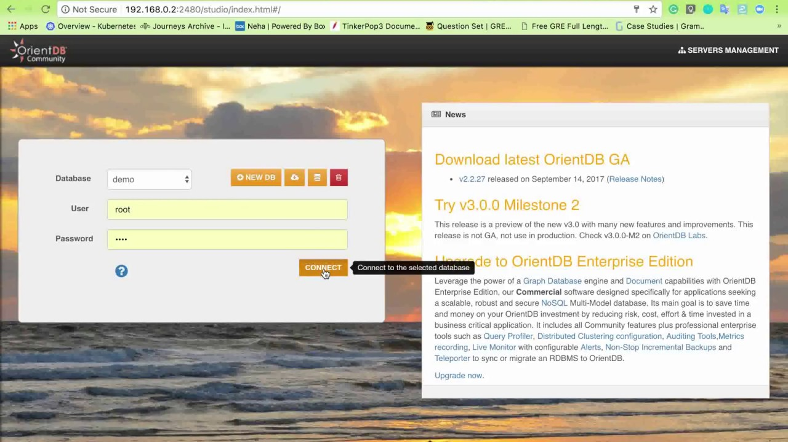](https://www.youtube.com/watch?v=oGj2Bi_Viqo&t=15s)

# Steps

Follow these steps to setup and run this developer journey. The steps are
described in detail below.

1. [Deploy OrientDB on Kubernetes Cluster](#1-deploy-orientdb-on-kubernetes-cluster)
1. [Sign up for the Watson Studio](#2-sign-up-for-the-data-science-experience)
1. [Create the notebook](#3-create-the-notebook)
1. [Add the data](#4-add-the-data)
1. [Update the notebook with service credentials](#5-update-the-notebook-with-service-credentials)
1. [Flow of the notebook](#6-flow-of-the-notebook)
1. [Run the notebook](#7-run-the-notebook)
1. [Analyze the results](#8-analyze-the-results)

## 1. Deploy OrientDB on Kubernetes Cluster
Deploy OrientDB on Kubernetes cluster using [Deploy OrientDB on Kubernetes](https://github.com/IBM/deploy-graph-db-container). It will expose the ports on IBM Cloud through which OrientDB can be accessed from the Jupyter notebook on IBM Watson Studio. Use the `ip-address of your cluster` and node port `port 2424` on which the OrientDB console is mapped, to access that OrientDB through Jupyter notebook.

## 2. Sign up for Watson Studio
      
Sign up for IBM's [Watson Studio](http://datascience.ibm.com/). By creating a project in Watson Studio a free tier ``Object Storage`` service will be created in your IBM Cloud account.

## 3. Create the notebook

* Open [IBM Watson Studio](https://dataplatform.ibm.com).
* Click on `Create notebook` to create a notebook.
* Select the `From URL` tab.
* Enter a name for the notebook.
* Optionally, enter a description for the notebook.
* Enter this Notebook URL: https://github.com/IBM/graph-db-insights/blob/master/notebooks/graphdb-insights.ipynb
* Select the free Anaconda runtime.
* Click the `Create` button.
 
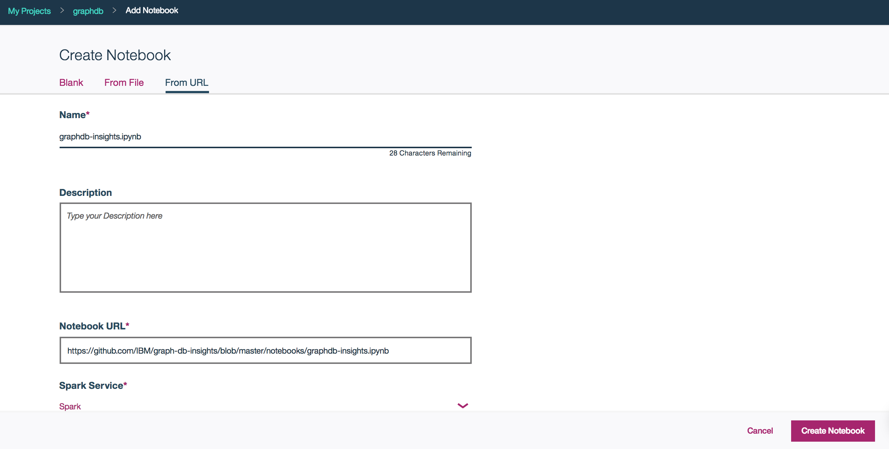

### 3.1. Additional notes for the notebook.
* Before uploading the `config.json` configuration file to Object storage, make sure you update the config file with
  username and password that you have setup for orientdb in the first step `1. Deploy OrientDB on Kubernetes Cluster`

## 4. Add the data

##### Add the data to the notebook
* Please download the files from :
 https://www.kaggle.com/deepmatrix/imdb-5000-movie-dataset .
* Trim the data to 600 rows for the purpose of this tutorial and Rename the file  `Graphdb-Insights.csv`
* From your project page in Watson Studio, click `Find and Add Data` (look for the `10/01` icon)
and its `Files` tab.
* Click `browse` and navigate to `Graphdb-Insights.csv` on your computer.
* Add the files to Object storage.

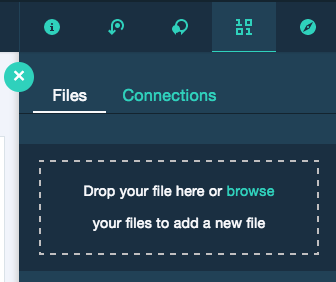

* Repeat the above steps to upload `config.json` Watson Studio configuration file to Object storage from URL:
  https://github.com/IBM/graph-db-insights/blob/master/configuration/config.json

## 5. Update the notebook with service credentials

##### Add the Object Storage credentials to the notebook
* Use `Find and Add Data` (look for the `10/01` icon) and its `Files` tab. You should see the file names uploaded earlier. Make sure your active cell is the empty one created earlier.
* Select `Insert to code` below config.json and click insert credentials from the dropdown. Please rename the variable to `credentials_1` if the name is different.
* Select the cell below `3. Add your service credentials for Object Storage` section in the notebook to update the credentials for Object Store.

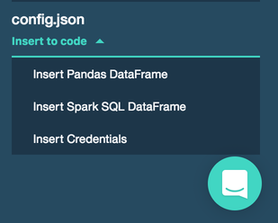

* Select `Insert to code` below Graphdb-Insights.csv(movie dataset) and click Insert Pandas Dataframe from the dropdown in the empty cell below `4.2. Loading the IMDb movie data`.

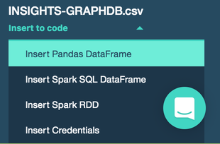

## 6. Flow of the notebook
The notebook has been divided into various sections with each section performing a specific task on the OrientDB.
* `Setup` which deals with the installation of the OrientDB, importing the packages and libraries, adding the credentials of the files from object storage and loading them in the notebook for use.
* `Utility Functions and Core functions` The notebook creates a graph with two node classes- `person` class and `movie` class. With person class as its attributes as: `name`, `fblikes`, `role(actor/ director)` and movie class as its attributes as: `title`, `year`, `durationInMins`, `imdbRating`, `genre`, `plotKeywords`, `numCriticForReviews`, `movieFacebookLikes`. There are two types of relationships involved in connecting the nodes, one is `worked_with`, which is between the two person nodes who have worked togther in the same movie and another one is `acted_in`, which between a person node and movie node for a person who have acted in a particular movie. The utility functions are written to keep a check on the duplicacy as `IF NOT EXISTS` is only valid for creating the properties in the OrientDB. Unlike in SQL, `IF NOT EXISTS` doesn't work with `create class` or `insert` statements in OrientDB. The core functions are for creating database, creating graph as discussed, and get insights from the graph created.
* `Insights and Visualization` which focuses on  performing various operations on and get insights from the OrientDB database.

## 7. Run the notebook

When a notebook is executed, what is actually happening is that each code cell in
the notebook is executed, in order, from top to bottom.

Each code cell is selectable and is preceded by a tag in the left margin. The tag
format is `In [x]:`. Depending on the state of the notebook, the `x` can be:

* A blank, this indicates that the cell has never been executed.
* A number, this number represents the relative order this code step was executed.
* A `*`, this indicates that the cell is currently executing.

There are several ways to execute the code cells in your notebook:

* One cell at a time.
  * Select the cell, and then press the `Play` button in the toolbar.
* Batch mode, in sequential order.
  * From the `Cell` menu bar, there are several options available. For example, you
    can `Run All` cells in your notebook, or you can `Run All Below`, that will
    start executing from the first cell under the currently selected cell, and then
    continue executing all cells that follow.
* At a scheduled time.
  * Press the `Schedule` button located in the top right section of your notebook
    panel. Here you can schedule your notebook to be executed once at some future
    time, or repeatedly at your specified interval.

For this Notebook, to run every cell one by one is recommended so as to understand the flow of the notebook and also to comprehend  the operation performed by each cell on OrientDB better.

## 8. Analyze the results

The notebook uses two use cases to demonstrate how to get insights from the OrientDB like `the most mentioned movie` and the `clustering of the movies with IMDb rating greater than 7`. Each insight has its own function in the notebook. Check the cell `Core Functions` in notebook, you will find the functions for the same. Call those functions to get the results. The following image shows the functions and its results.

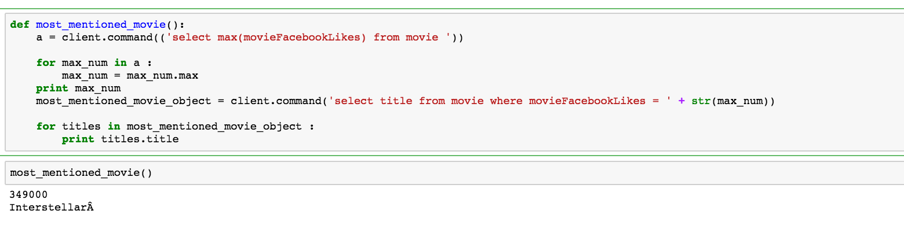

OrientDB also provides an interactive dashboard OrientDB studio for visualization of the graph and to view the results of the queries. You can run the queries in the browse section of the OrientDB studio to get the desired insights or to create the node and Edges. The same two queries which the notebook uses i.e. `to get the most mentioned movie and the clustering of the movies with IMDb rating greater than 7` can be executed in the browse section of the OrientDB to analyze the results, check the screenshot of the OrientDB Studio below for the same. The results of the query executed are available in the form of table and JSON. And the results can also be downloaded as CSV for further analysis.

#### * run the Query to `cluster the movies with IMDb rating greater than 7` and view the results in table format

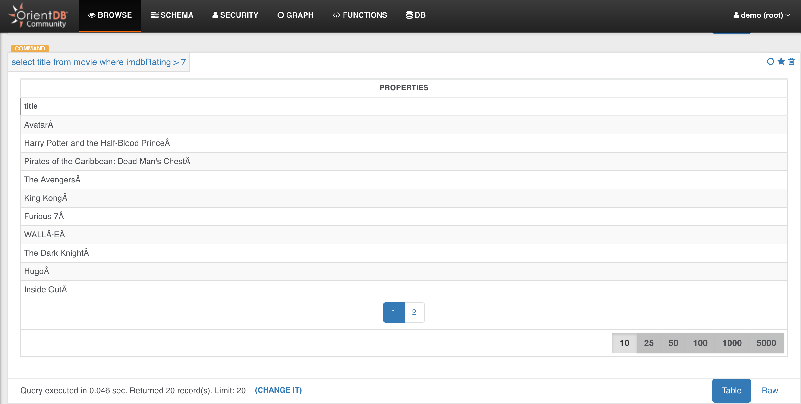

#### * run both the Queries to get the `most_mentioned` movie and view results in the form of the table

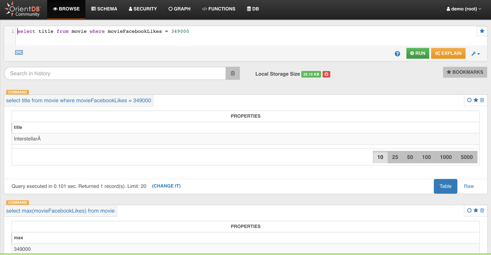

#### * run the Query for `most_mentioned` and view the results in the json format

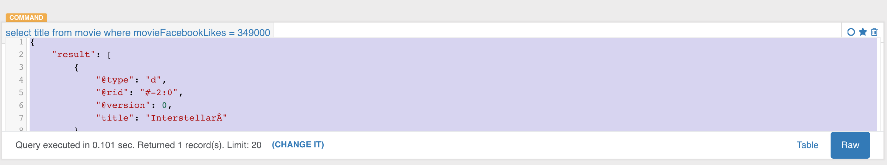

To visualize the graph created by using the functions written in the notebook,
* open the graph editor of the OrientDB Studio
* execute the graph query in the graph editor.
* results of the query will be in the form of the graph. For example, to find the connections of a node in the graphdb i.e. `to find the coworkers of the actor Tom Hanks `.

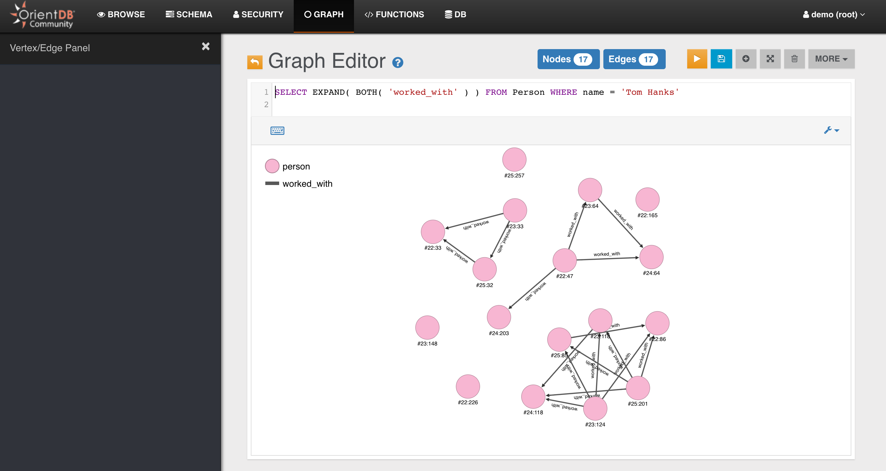

* You can follow this video tutorial on [OrientDB studio](https://www.youtube.com/watch?v=l-OVSjf-vk0&t=7s) created for the purpose of this notebook to demonstrate the results of the queries used in the tutorial.
