# Graph-db-insights(work in progress!)
Graph databases are well-suited for analyzing interconnections, which is why there has been a lot of interest in using graph databases to mine data from social media. Graph databases are also useful for working with data in business disciplines that involve complex relationships and dynamic schema, such as supply chain management, identifying the source of an IP telephony issue and creating "customers who bought this also looked at..." recommendations.This journey aims to give hands on experience to developers, Data Analysts, Data Scientist who wants to work with graph database for their business needs.This tutorial gives you a head start to a graphdb-Orientdb.This journey will help developers get started with orientdb using both sql and gremlin- which is a specialised query language for property graphs  by Apache Tinkerpop that works on all major graph databases.

In this journey we will demonstrate:

* a brief introduction to graph theory, just so developers can appreciate graph theory.
* Introduction to graph database - OrientDb
* Hands-on on the crud operations and traversal on graph database using gremlin and sql on orientdb Console.
* How to get insights out of it on orientdb console, orientdb studio as well as ipython notebook.
* Visualisation of the results. 

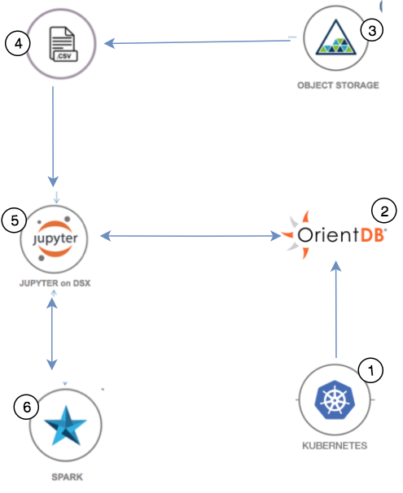

1. The Kuberntes Cluster on which orientdb is running.
2. Orientdb instance on kubernetes.
3. Object storage stores the config file and kaggle imdb data.
4  config file and data used in the jupyter notebook.
5. The Jupyter notebook processes the data and generates insights.It can viewed in orientdb Studio.
6. The Jypyter notebook is powered by Spark.
 

   
## Included components

* [Orientdb](http://orientdb.com/orientdb/): A Multi-Model Open Source NoSQL DBMS.

* [IBM Data Science Experience](https://apsportal.ibm.com/analytics): Analyze data using RStudio, Jupyter, and Python in a configured, collaborative environment that includes IBM value-adds, such as managed Spark.

* [Bluemix Object Storage](https://console.ng.bluemix.net/catalog/services/object-storage/?cm_sp=dw-bluemix-_-code-_-devcenter): A Bluemix service that provides an unstructured cloud data store to build and deliver cost effective apps and services with high reliability and fast speed to market.

* [Jupyter Notebooks](http://jupyter.org/): An open-source web application that allows you to create and share documents that contain live code, equations, visualizations and explanatory text.

* [Kubernetes Clusters](https://console.ng.bluemix.net/docs/containers/cs_ov.html#cs_ov)

* [Bluemix container service](https://console.ng.bluemix.net/catalog/?taxonomyNavigation=apps&category=containers)

## Featured technologies

* [Data Science](https://medium.com/ibm-data-science-experience/): Systems and scientific methods to analyze structured and unstructured data in order to extract knowledge and insights.

## Prerequisite

Create a Kubernetes cluster with [IBM Bluemix Container Service](https://github.com/IBM/container-journey-template) to deploy in cloud.Deploy orientdb on kubernetes container using [Deploy Orientdb on container]( https://github.com/IBM/deploy-graph-db-container). 

# Watch the Video
[Orientdb Studio Tutorial](https://youtu.be/l-OVSjf-vk0) gives a head start on how to play around with orientdb studio.

# Steps

Follow these steps to setup and run this developer journey. The steps are
described in detail below.

1. [Brief Introduction to the Graph Theory](#1-Brief-Introduction-to-the-Graph-Theory)
1. [Orientdb-a multi model database.](#2-Orientdb-a-multi-model-database.)
1. [Orientdb Console ](#3-Orientdb-Console )
1. [Orientdb Gremlin Console ](#4-Orientdb-Gremlin-Console )
1. [Orientdb Studio](#5-Orientdb-Studio)
1. [PyOrient](#6-PyOrient-Python-Driver-for-orientdb)
1. [Sign up for the Data Science Experience](#7-sign-up-for-the-data-science-experience)
1. [Create the notebook](#8-create-the-notebook)
1. [Add the data](#9-add-the-data)
1. [Update the notebook with service credentials](#10-update-the-notebook-with-service-credentials)
1. [Run the notebook](#11-run-the-notebook)

## 1. Brief Introduction to the Graph Theory
Every day we are surrounded by countless connections and networks: roads and rail tracks, phone lines and the internet, electronic circuits and even molecular bonds. There are also social networks between friends and families. All these systems consist of certain points, called nodes/vertices, connected by lines, called edges(link between two nodes). All these networks are called Graphs.

In the domain of mathematics and computer science, graph theory is the study of graphs that concerns with the relationship among edges and vertices. It is a popular subject having its applications in computer science, information technology, biosciences, mathematics, and linguistics to name a few. 
Formally, a graph is a pair of sets (V, E), where V is the set of vertices and E is the set of edges, connecting the pairs of vertices. Take a look at the following graph −

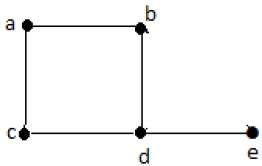 

In the above graph,
V = {a, b, c, d, e}
E = {ab, ac, bd, cd, de}
 
A graph is composed of two elements: a node and a relationship(edges).Each node represents an entity (a person, place, thing, category or other piece of data), and each relationship represents how two nodes are associated. This general-purpose structure allows you to model all kinds of scenarios – from a system of roads, to a network of devices, to a population’s medical history or anything else defined by relationships.

## 2. Orientdb-a multi model database.
Orientdb is a Multi-Model Open Source NoSQL DBMS that combines the power of graphs with documents, key/value, reactive, object-oriented and geospatial models into one scalable, high-performance operational database.Because of the ubiquitous nature of the SQL in the world of Database developers.Developers are familiar and comfortable with SQL. Therefore, Instead of inventing new query language Orientdb extended sql to support more complex graph concepts like Trees and Graphs. Apart from sql, It provides the APIs and Drivers for Python, Java, Javascript, NodeJs, PHP, .NET and Gremlin- A specialised query language for property graphs. To know more about what are graph databases? and what are property graphs? , you can go through these links :

[Orientdb](http://orientdb.com/graph-database/)

[Property Graph](https://github.com/tinkerpop/gremlin/wiki/Defining-a-Property-Graph)

## 3. Orientdb Console 
Demonstrating the following operations in gremlin and sql on console -
 1. Accessing the console.
 2. Creating and connecting database 
 3. Creating Node classes, Edge classes and their properties.
 4. Creating vertex.
 5. Creating and edge between the two vertex.
 6. Retrieving edge/vertex  based on a condition.
 7. Updating an edge/vertex.
 8. Deleting an edge/vertex.
 9. Insights

#### 1. Accessing the console.
  * In the bin folder of orientdb run `./console.sh` on the terminal to access the orientdb console.To access the gremlin console run `./gremlin.sh`.
  
    
 
 
#### 2. connecting to server and Creating database 
  * on the orientdb console run CONNECT remote:<ip-of-the-orientdb-kubernetes-cluster> <username> <password> 
   
   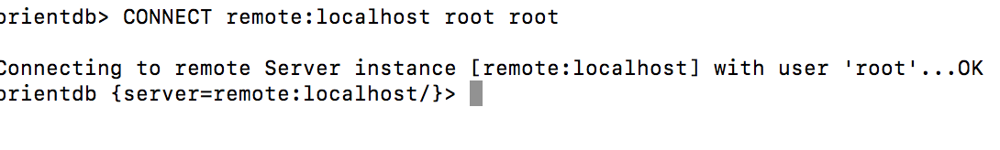
   
  * You are connected to the server now , let’s create a new database. To create type create database remote:localhost/<name-of-the-database> <username> <password> plocal graph
  
    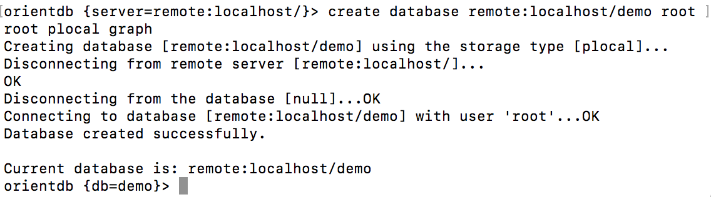
   
  * To verify that you are connected to orientdb, type command LIST DATABASES and you should see the databases present in the orientdb.
  
    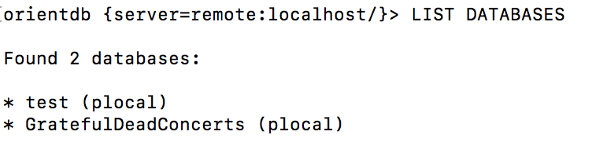
  
  * on the gremlin console run g = new OrientGraph("remote:<ip-of-the-orientdb-kubernetes-cluster>/<database-name>");
    
    

#### 3. Creating Node classes, Edge classes and their properties.
For this tutorial, I have created  two vertex classes namely - Person and Movie. With Person’s attributes/ Properties :  Role: Director/ActorName, Fb-likes and Movie’s Attribute: Title, Year, IMDB rating, Duration, Language, Genre, Plot keywords, Num_critic_for_reviews, movie_facebook_likes. And two Edge classes - acted_in and worked_with.

* To create vertex class, on your console type  create class <classname> extends V
    create class person extends V
    create class movie extends V
        
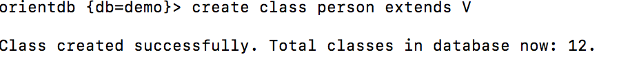

* To create property of the vertex class, run this command : 
Create property <class-name>.<name-of-the-property>  IF NOT EXISTS   TYPE.  

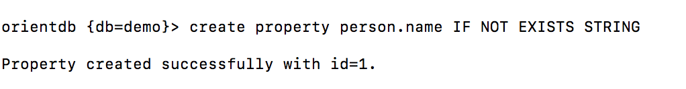

* Creating Edge Class.
To create edge class, on your console type : create class <classname> extends E.
  
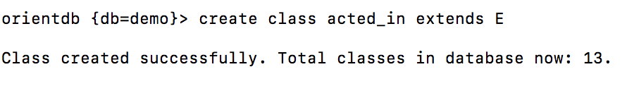
  
* Edges have two ends.It always start from one vertex class and ends on another vertex.Its acts as a bridge between two vertices.Hence, The edge will always have in and out property. To create property of the Edge class, run this command :
        Create property <class-name>.in  IF NOT EXISTS  Link  <linked_vertex_class>  
        Create property <class-name>.out  IF NOT EXISTS Link  <linked_vertex_class>
Example :

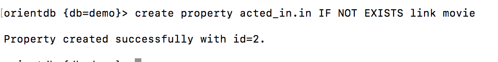

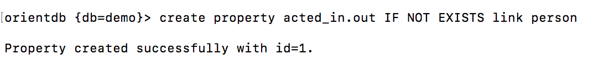

* Run these commands to create node classes, edge classes and their respective properties. 
 
#### 4. Creating Records/Vertex / Inserting
* To create records in the orientdb, run the following command on your console :
INSERT INTO  <vertex-class-name> (<class-property-1>,<class-property-2>, <class-property-3>......) VALUES (value1,value2,value3 ………...)
Example :
INSERT INTO person (name, fblikes, role) VALUES ("Scarlett Johansson",19000.0,"actor")

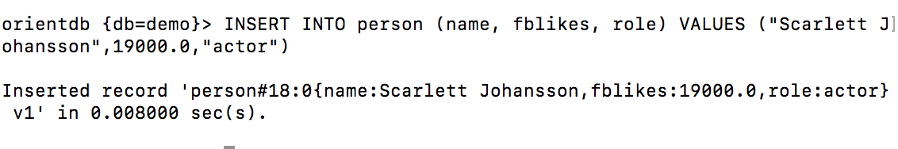

#### 5. Creating Relation/Edge between the two vertices:
* Run the following command on your console  to create relation/edge between two vertices.Please Note! Since orientdb is a nosql database, You can use edge class which has already been created or you can give any name to your relation and orientdb will automatically create a new edge class with that name. Before running this command, make sure the vertices you are trying to connect with this edge are already present.Otherwise, it will throw an error. Check the screenshot below, Before running the create edge command, I have created two nodes I want to connect, vertex/node with name CCH Pounder and Joel David Moore.
Syntax:
create edge <give-name-of-the-relation> from (select from person where name = "name-of-the-vertex") to (select from person where name = "name-of-the-vertex")
Example :
create edge worked_with from (select from person where name = "CCH Pounder") to (select from person where name = "Joel David Moore")

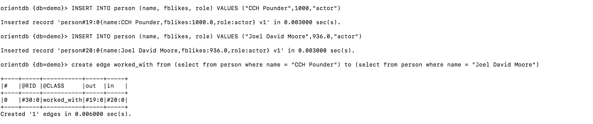

#### 6. Retrieving edge/vertex  based on a condition.
* Use SELECT in orientdb, Similar to the select in sql to retrieve data on a particular condition. Suppose, You want to retrieve the fblikes of an actor with name Scarlett Johansson.
Syntax : select <whichever-parameter-you-want-retrieve> from <name-of-the-class> where <condition>
Example : select fblikes from person where name = "Scarlett Johansson"
 
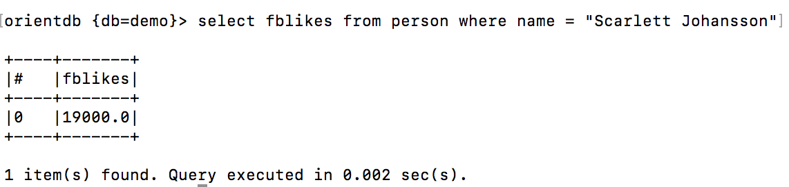

#### 7. Updating an edge/vertex.
* To update class or record, the syntax is :
UPDATE <class>|CLUSTER:<cluster>|<recordID>
 [SET|INCREMENT|ADD|REMOVE|PUT <field-name> = <field-value>[,]*]|[CONTENT|MERGE <JSON>]
 [UPSERT]
 [RETURN <returning> [<returning-expression>]]
 [WHERE <conditions>]
 [LOCK default|record]
 [LIMIT <max-records>] [TIMEOUT <timeout>]
Example : To update a role of a person where name is "Scarlett Johansson" from actor to director --
UPDATE person SET role='director' UPSERT where name = "Scarlett Johansson"

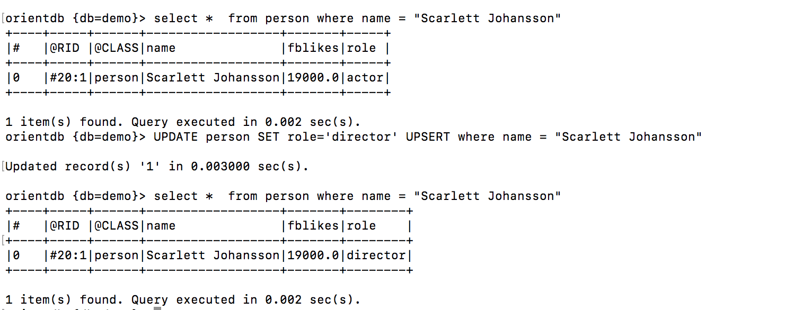

#### 8. Deleting an edge/vertex.
* Deleting an edge/vertex.
DELETE EDGE
You can delete one or more edges from the database. Use this command if you work against graphs. The "Delete edge" command takes care to remove all the cross references to the edge in both "in" and "out" vertices.
Syntax
DELETE EDGE <rid>|[<rid> (, <rid>)*]|FROM <rid>|TO <rid>|[<class>] [WHERE <conditions>]> [LIMIT <MaxRecords>]
Example :
DELETE edge worked_with from (select from person where name = "CCH Pounder") to (select from person where name = "Joel David Moore")

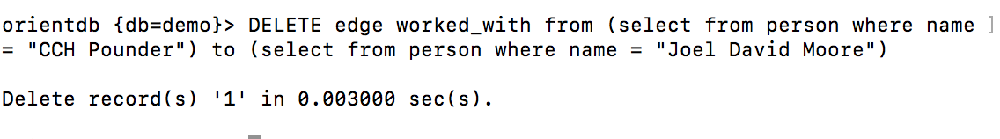

* DELETE VERTEX        
You can  delete one or more vertices from the database. Use this command if you work against graphs. The "Delete Vertex" (like the Delete Edge) command takes care to remove all the cross references to the vertices in all the edges involved.
Syntax:
DELETE VERTEX <rid>|<class>|FROM (<subquery>) [WHERE <conditions>] [LIMIT <MaxRecords>>]
Example :
DELETE VERTEX from person where name = "Scarlett Johansson"

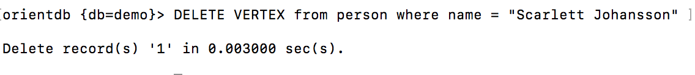

#### 9. Insights
You created and populated a small graph of movie dataset.To cross edges, you can use special graph functions, such as:
* OUT() To retrieve the adjacent outgoing vertices
* IN() To retrieve the adjacent incoming vertices
* BOTH() To retrieve the adjacent incoming and outgoing vertices
For example, To know with who all Johnny Depp ‘worked_with’  --- ( his co-workers)
SELECT out('worked_with') FROM person WHERE name = 'Johnny Depp'

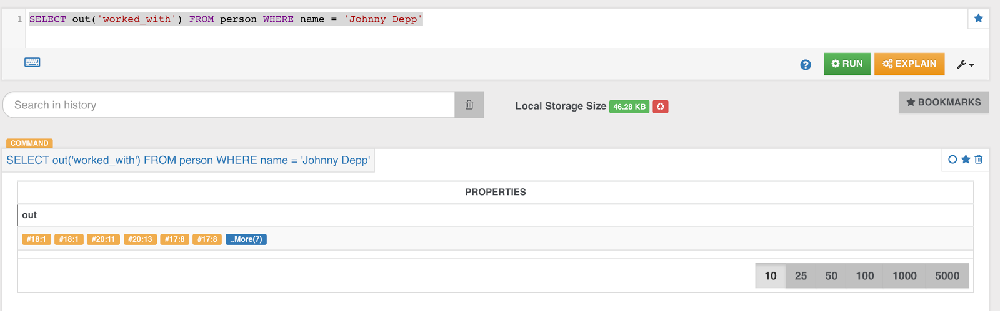

## 4. Orientdb Gremlin Console 
* To access the gremlin console run `./gremlin.sh`.
  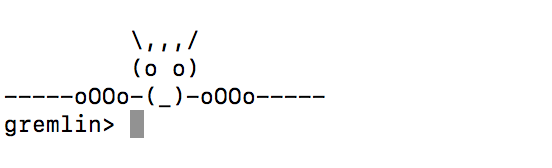
  
* Connecting to orientdb:
  To open a database on a remote server. Assure the server is up and running. To start the server just launch server.sh.
    g = new OrientGraph("remote:<ip-of-the-kubernetes-cluster>/<database-name>");
    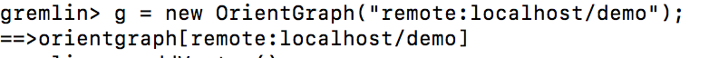
  
* Creating vertex, To create a new vertex use the addVertex() method. The vertex will be created and the unique id will be displayed as return value.: run g.addVertex();
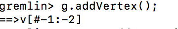

* Creating an edge :
To create a new edge between two vertices use the addEdge(v1, v2, label) method. The edge will be created with the label specified.
v1 = g.addVertex();
v2 = g.addVertex();
e = g.addEdge(v1, v2, 'worked_with');

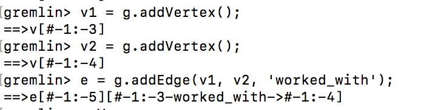

* Display all the vertices present in the database :
 Use g.V method to do so!
 
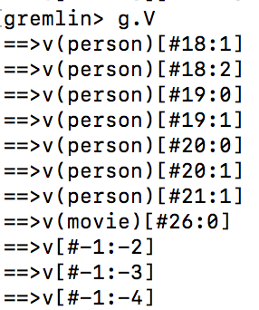

* Get a vertex with a particular id :
        To retrieve a vertex by its ID, use the v(id) method passing the record id as argument (with or without the prefix '#').Run : g.v('18:1')
        

* Retrieve all the edges present in the graph :
        To retrieve all the edges present in the graph, use g.E method.
        
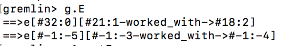

* Traversal
Gremlin is  very powerful in traversing graphs. Once you have a graph loaded in your database you can traverse it in many ways.
Basic Traversal
To display all the outgoing edges of the first vertex , use the .outE at the vertex. Example: v1.outE

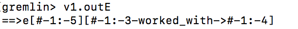

And to display all the incoming edges of the second vertex, use .inE method. Example v2.inE

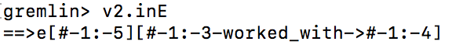

* Filter results
For example , if you want to return all the outgoing edges of all the vertices with label equals to 'worked_with’
g.V.outE('worked_with')

## 5. Orientdb Studio

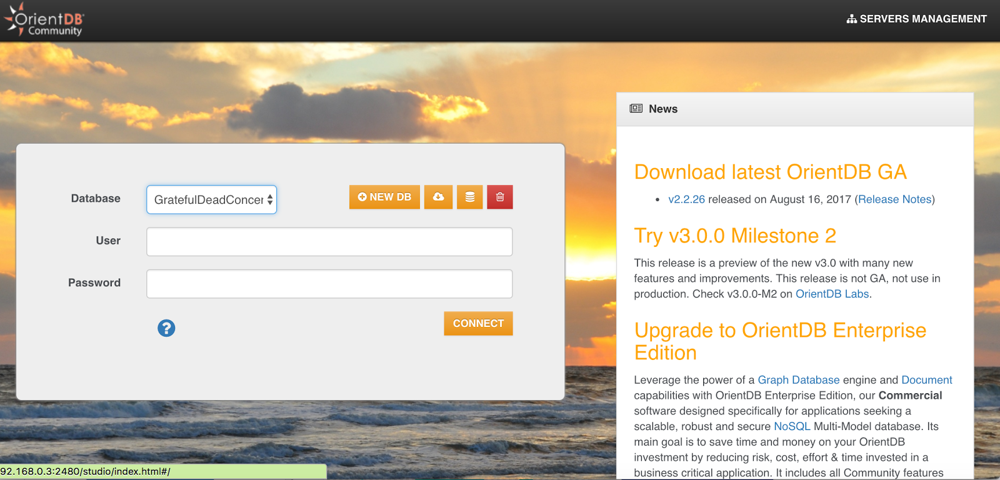

* open the browser and hit http://<ip-address-of-the-kubernetes-cluster>:<node-port mapped to port 2480 of orientdb>/ to access orientdb  
* Select the database you want to work on from dropdown. Using login credentials- the username and the password for orientdb to login. 
* Follow the video tutorial [Orientdb Studio Tutorial](https://youtu.be/l-OVSjf-vk0) on how to perform various operations on orientdb.
* All the commands discussed in the orientdb console part of the tutorial can be executed in the browse section of orientdb.The result can be viewed in the table/raw(json) format. And can also be exported to csv file.To export the result to csv, In the browse section click the setting button. And then run the query.

## 6. PyOrient(Python Driver for orientdb)
The orientdb can also accessed through python using pyorient.If you are using the Data Science Experience ( DSX) , set up the orientdb on kubernetes is important.This is because if you set up the orientdb locally, you won’t able to access it through DSX, as the orientdb console port 2424 and orientdb studio 2480 wouldn’t be exposed on bluemix.Deploy orientdb on kubernetes container using [Deploy Orientdb on Kubernetes]( https://github.com/IBM/deploy-graph-db-container) will expose the ports on bluemix through which orientdb can be accessed from the notebook on data science experience.You can use the ip-address of your cluster and node port on which the port 2424 orientdb console is mapped, to access that orientdb through notebook.Notebook's markdown and comments are self explanatory to make you understand its functioning.

Set up the Notebook on Data Science experience with object storage using following steps :

## 7. Sign up for the Data Science Experience

Sign up for IBM's [Data Science Experience](http://datascience.ibm.com/). By signing up for the Data Science Experience, two services: ``DSX-Spark`` and ``DSX-ObjectStore`` will be created in your Bluemix account.

## 8. Create the notebook

* Open [IBM Data Science Experience](https://apsportal.ibm.com/analytics). 
* Use the menu on the top to select `Projects` and then `Default Project`.
* Click on `Add notebooks` (upper right) to create a notebook.
* Select the `From URL` tab.
* Enter a name for the notebook.
* Optionally, enter a description for the notebook.
* Enter this Notebook URL: https://github.com/IBM/graph-db-insights/notebooks/Graphdb-Insights.ipynb
* Click the `Create Notebook` button.

## 9. Add the data 

##### Add the data to the notebook
* Please download the files from :
 https://www.kaggle.com/deepmatrix/imdb-5000-movie-dataset .
* Trim the data to 600 rows for the purpose of this tutorial and Rename the file  `Graphdb-Insights.csv`
* From your project page in DSX, click `Find and Add Data` (look for the `10/01` icon)
and its `Files` tab. 
* Click `browse` and navigate to `Graphdb-Insights.csv` on your computer.
* Add the files to Object storage.
* Repeat the above Steps for `config.json` as well.

## 10. Update the notebook with service credentials.

##### Add the Object Storage credentials to the notebook
* Select the cell below `2.1 Add your service credentials for Object Storage` section in the notebook to update the credentials for Object Store. 
* Use `Find and Add Data` (look for the `10/01` icon) and its `Files` tab. You should see the file names uploaded earlier. Make sure your active cell is the empty one created earlier. 
* Select `Insert to code` below Graphdb-Insights.csv as pandas Dataframe.
* Click `Insert Crendentials` from the drop down menu.
* Repeat the above steps for `config.json`.

## 11. Run the notebook

When a notebook is executed, what is actually happening is that each code cell in
the notebook is executed, in order, from top to bottom.

Each code cell is selectable and is preceded by a tag in the left margin. The tag
format is `In [x]:`. Depending on the state of the notebook, the `x` can be:

* A blank, this indicates that the cell has never been executed.
* A number, this number represents the relative order this code step was executed.
* A `*`, this indicates that the cell is currently executing.

There are several ways to execute the code cells in your notebook:

* One cell at a time.
  * Select the cell, and then press the `Play` button in the toolbar.
* Batch mode, in sequential order.
  * From the `Cell` menu bar, there are several options available. For example, you
    can `Run All` cells in your notebook, or you can `Run All Below`, that will
    start executing from the first cell under the currently selected cell, and then
    continue executing all cells that follow.
* At a scheduled time.
  * Press the `Schedule` button located in the top right section of your notebook
    panel. Here you can schedule your notebook to be executed once at some future
    time, or repeatedly at your specified interval.

For this Notebook, To run every cell one by one is recommended. It will give a better understanding on how things are working.

# Troubleshooting

[See DEBUGGING.md.](DEBUGGING.md)

# License

[Apache 2.0](LICENSE)

